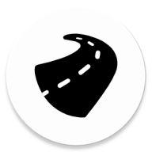

    

<h2 align="center">
    Grodno Roads - actual information on the road
</h2>

    
    
    
    

# EN
The application shows on the map the current situation on the roads of Grodno and the region.

Current functionality:
- display of stationary/temporary/mobile cameras
- the ability to send events about the traffic police and accidents
- voice alerts

# Try without building sources

## Issues
In case bug and suggestions, please create issue.

### Useful gradle commands

Check dependency updates: `./gradlew dependencyUpdates`
Run compose metrics: `./gradlew app:android:assembleRelease -PenableComposeCompilerReports=true` 
Generate kmp buildconfig: `./gradlew :kmp:shared:components:generateBuildKonfig`

Build ui-demo: `./gradlew app:ui-demo:assembleRelease`

Build app debug: `./gradlew app:android:assembleDebug`
Build app release: `./gradlew app:android:assembleRelease`