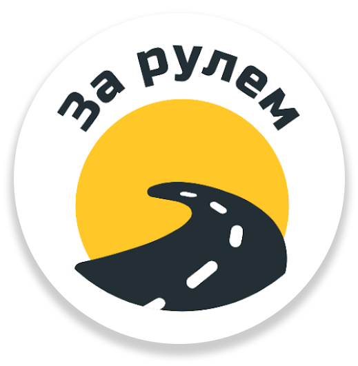
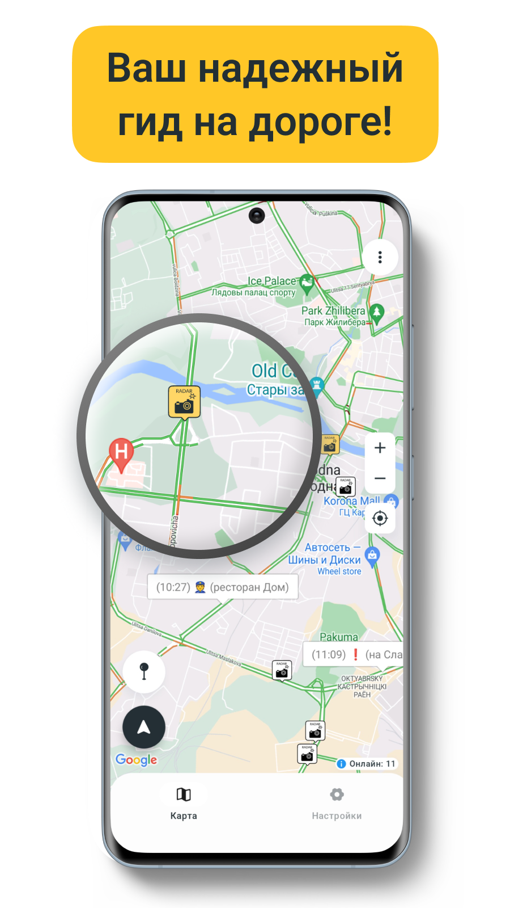
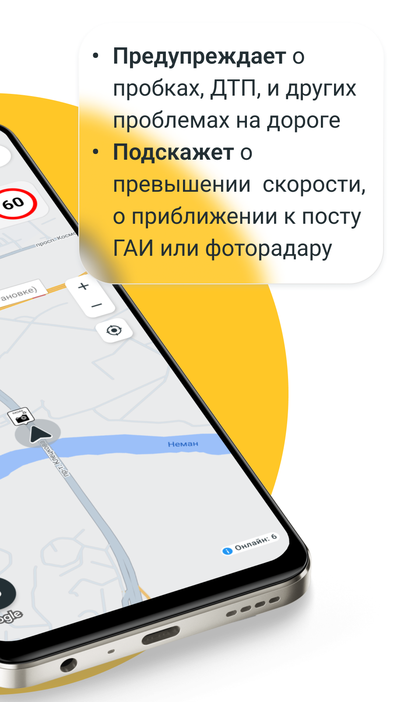
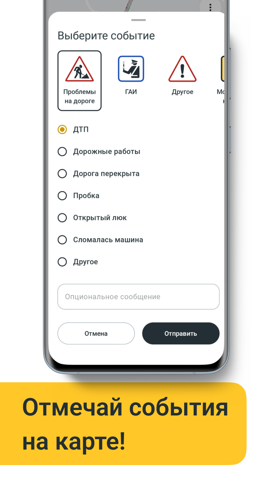
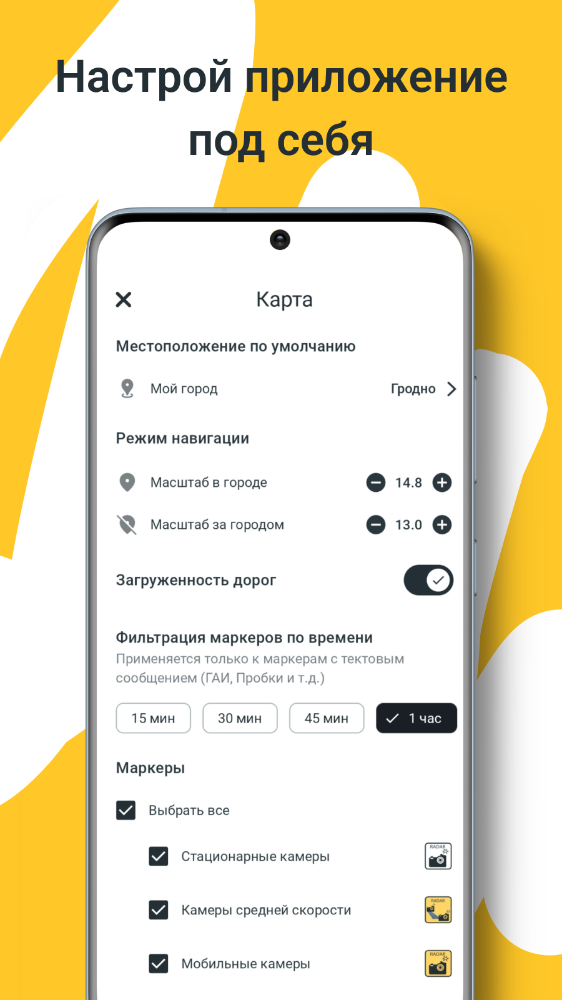
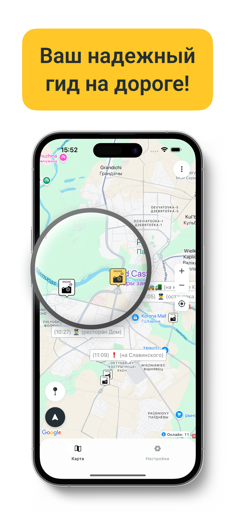
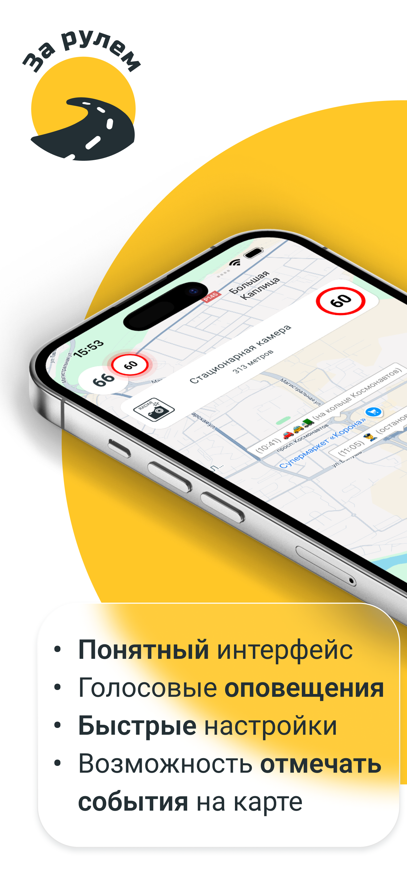
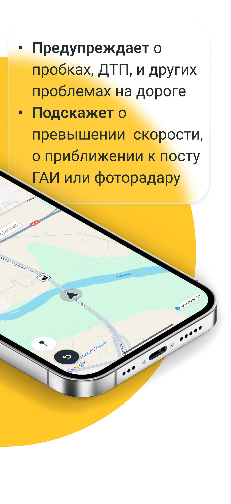
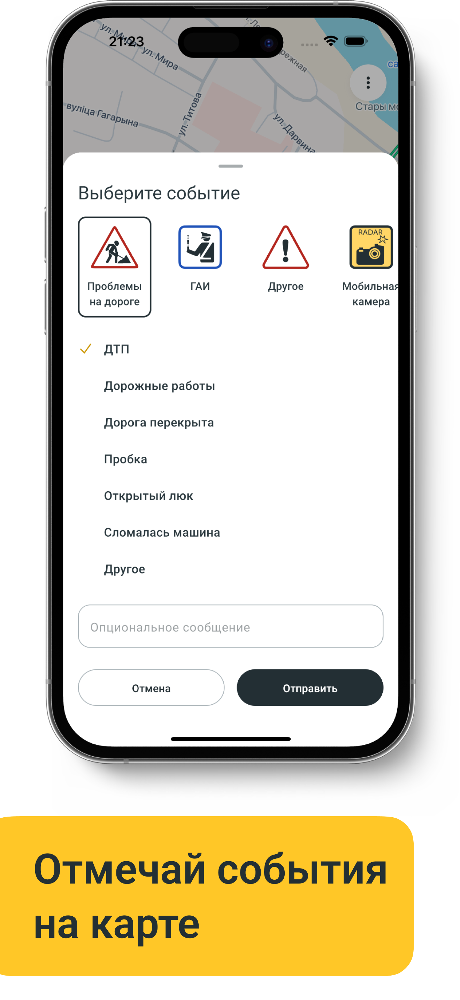
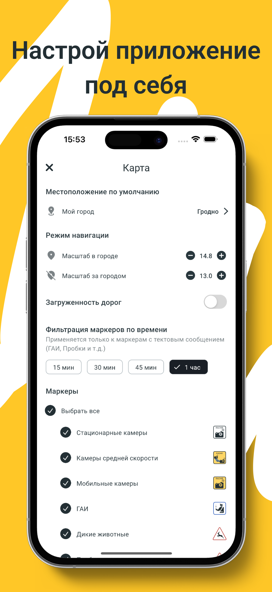

    

<h2 align="center">
    Behind the Wheel - actual information on the road
</h2>

    
    
    

| Android                                                                                                                     | iOS                                                                                        |
|-----------------------------------------------------------------------------------------------------------------------------|--------------------------------------------------------------------------------------------|
|  |  |

## About

Compose Multiplatform application with iOS/Android target.

#### Key features:

- observe up-to-date information about traffic events throughout the Grodno region
- all information is automatically plotted on the map
- navigation mode allows to drive without being distracted by your phone
- voice alerts about upcoming events
- detailed information about the stationary and mobile speed cameras

The application can be customised for yourself:

- select your default city
- leave the types of events you need on the map
- the radius of voice alerts
- language preferences and e.t.

## Tech info

- Multi module architecture
- Built with Compose Multiplatform with iOS/Android targets
- Decompose for navigation and UI component lifecycle management
- MVIKotlin for unidirectional data flow architecture
- Koin for dependency injection
- DataStore for persistent preferences storage
- Firebase for analytics, crashlytics, and real-time database
- Custom Compose multiplatform Google Maps wrapper
- Voice alerts system using device TTS capabilities
- Material 3 design system
- Spotless for code style enforcement

## App screenshots

### Android

### iOS

### Useful gradle commands

Update code style: `./gradlew spotlessApply`

Check code style: `./gradlew spotlessCheck`

Run compose metrics: `./gradlew app:android:assembleRelease -PenableComposeCompilerReports=true`

Generate kmp buildconfig: `./gradlew :kmp:shared:components:generateBuildKonfig`

Generate kmp buildconfig: `./gradlew :kmp:compose:maps-compose:generateBuildKonfig`

Build app debug: `./gradlew app:android:assembleDebug`

Build app release: `./gradlew app:android:assembleRelease`

Pods:
remove pod: `pod deintegrate`
init pod: `pod install`
